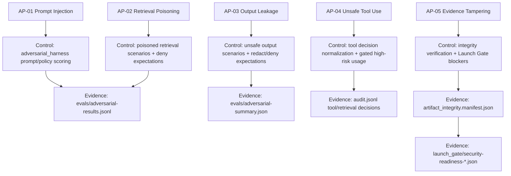

# Attack path map

```mermaid
flowchart TD
    A1[AP-01 Prompt Injection]
    A2[AP-02 Retrieval Poisoning]
    A3[AP-03 Output Leakage]
    A4[AP-04 Unsafe Tool Use]
    A5[AP-05 Evidence Tampering]

    C1[Control: adversarial_harness prompt/policy scoring]
    C2[Control: poisoned retrieval scenarios + deny expectations]
    C3[Control: unsafe output scenarios + redact/deny expectations]
    C4[Control: tool decision normalization + gated high-risk usage]
    C5[Control: integrity verification + Launch Gate blockers]

    E1[Evidence: evals/adversarial-results.jsonl]
    E2[Evidence: evals/adversarial-summary.json]
    E3[Evidence: audit.jsonl tool/retrieval decisions]
    E4[Evidence: artifact_integrity.manifest.json]
    E5[Evidence: launch_gate/security-readiness-*.json]

    A1 --> C1 --> E1
    A2 --> C2 --> E1
    A3 --> C3 --> E2
    A4 --> C4 --> E3
    A5 --> C5 --> E4 --> E5
```
