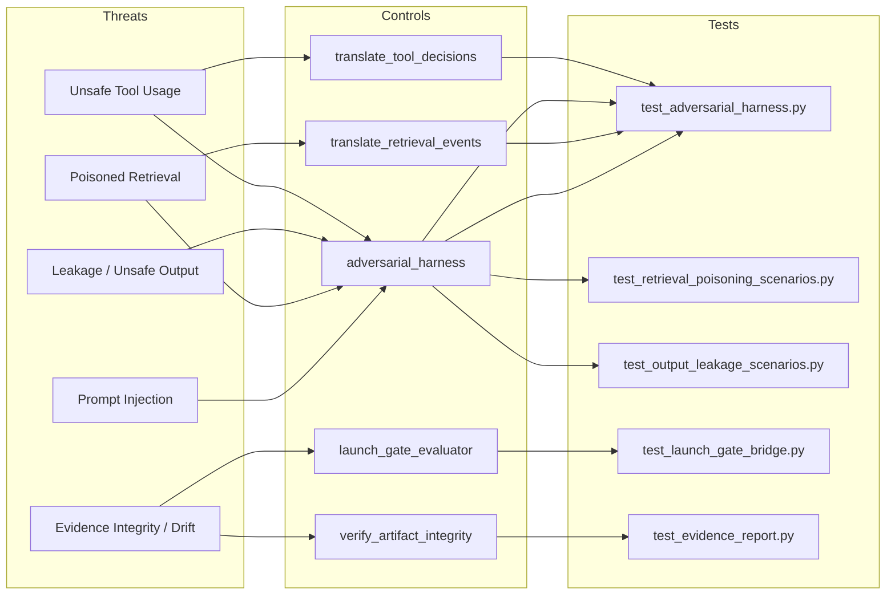

# Control coverage map

```mermaid
flowchart LR
    subgraph Threats
      T1[Prompt Injection]
      T2[Poisoned Retrieval]
      T3[Leakage / Unsafe Output]
      T4[Unsafe Tool Usage]
      T5[Evidence Integrity / Drift]
    end

    subgraph Controls
      H[adversarial_harness]
      TR[translate_retrieval_events]
      TT[translate_tool_decisions]
      LG[launch_gate_evaluator]
      VI[verify_artifact_integrity]
    end

    subgraph Tests
      TH[test_adversarial_harness.py]
      TRP[test_retrieval_poisoning_scenarios.py]
      TOL[test_output_leakage_scenarios.py]
      TLG[test_launch_gate_bridge.py]
      TER[test_evidence_report.py]
    end

    T1 --> H --> TH
    T2 --> H --> TRP
    T2 --> TR --> TH
    T3 --> H --> TOL
    T4 --> H --> TH
    T4 --> TT --> TH
    T5 --> LG --> TLG
    T5 --> VI --> TER
```
