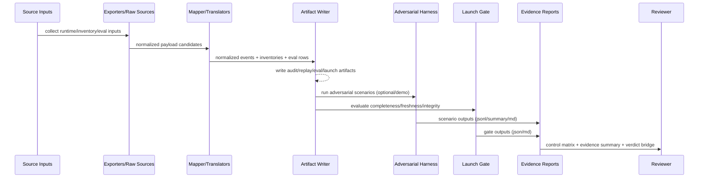

# Evidence generation flow

```mermaid
sequenceDiagram
    participant SRC as Source Inputs
    participant EXP as Exporters/Raw Sources
    participant MAP as Mapper/Translators
    participant ART as Artifact Writer
    participant ADV as Adversarial Harness
    participant LG as Launch Gate
    participant REP as Evidence Reports
    participant REV as Reviewer

    SRC->>EXP: collect runtime/inventory/eval inputs
    EXP->>MAP: normalized payload candidates
    MAP->>ART: normalized events + inventories + eval rows
    ART-->>ART: write audit/replay/eval/launch artifacts
    ART->>ADV: run adversarial scenarios (optional/demo)
    ART->>LG: evaluate completeness/freshness/integrity
    ADV->>REP: scenario outputs (jsonl/summary/md)
    LG->>REP: gate outputs (json/md)
    REP->>REV: control matrix + evidence summary + verdict bridge
```
