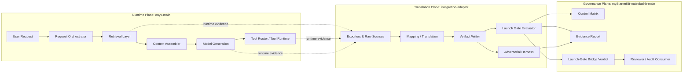

# RAG security architecture diagram

```mermaid
flowchart LR
    subgraph Runtime[Runtime Plane: onyx-main]
        U[User Request]
        RQ[Request Orchestrator]
        RET[Retrieval Layer]
        CTX[Context Assembler]
        GEN[Model Generation]
        TOOL[Tool Router / Tool Runtime]
    end

    subgraph Adapter[Translation Plane: integration-adapter]
        EXP[Exporters & Raw Sources]
        MAP[Mapping / Translation]
        ART[Artifact Writer]
        ADV[Adversarial Harness]
        LG[Launch Gate Evaluator]
    end

    subgraph Gov[Governance Plane: myStarterKit-maindashb-main]
        MAT[Control Matrix]
        EVR[Evidence Report]
        LGB[Launch-Gate Bridge Verdict]
        REV[Reviewer / Audit Consumer]
    end

    U --> RQ --> RET --> CTX --> GEN
    GEN --> TOOL
    RET -.runtime evidence.-> EXP
    TOOL -.runtime evidence.-> EXP
    GEN -.runtime evidence.-> EXP
    EXP --> MAP --> ART
    ART --> ADV
    ART --> LG
    LG --> MAT
    LG --> EVR
    LG --> LGB --> REV
    ADV --> EVR
```
