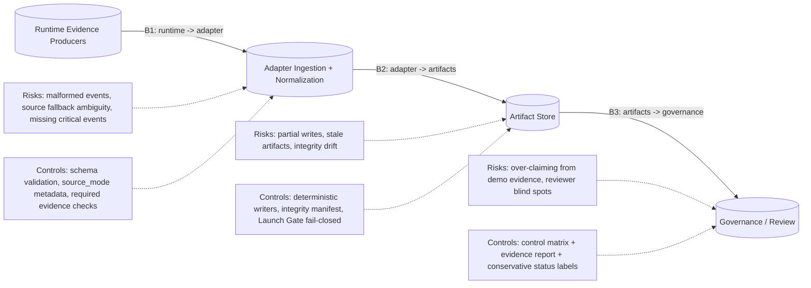

# Trust boundary map

```mermaid
flowchart LR
    RUNTIME[(Runtime Evidence Producers)]
    ADAPTER[(Adapter Ingestion + Normalization)]
    ARTIFACTS[(Artifact Store)]
    GOVERN[(Governance / Review)]

    RUNTIME -->|B1: runtime -> adapter| ADAPTER
    ADAPTER -->|B2: adapter -> artifacts| ARTIFACTS
    ARTIFACTS -->|B3: artifacts -> governance| GOVERN

    B1R["Risks: malformed events, source fallback ambiguity, missing critical events"]
    B2R["Risks: partial writes, stale artifacts, integrity drift"]
    B3R["Risks: over-claiming from demo evidence, reviewer blind spots"]

    B1C["Controls: schema validation, source_mode metadata, required evidence checks"]
    B2C["Controls: deterministic writers, integrity manifest, Launch Gate fail-closed"]
    B3C["Controls: control matrix + evidence report + conservative status labels"]

    B1R -.-> ADAPTER
    B2R -.-> ARTIFACTS
    B3R -.-> GOVERN

    B1C -.-> ADAPTER
    B2C -.-> ARTIFACTS
    B3C -.-> GOVERN
```
