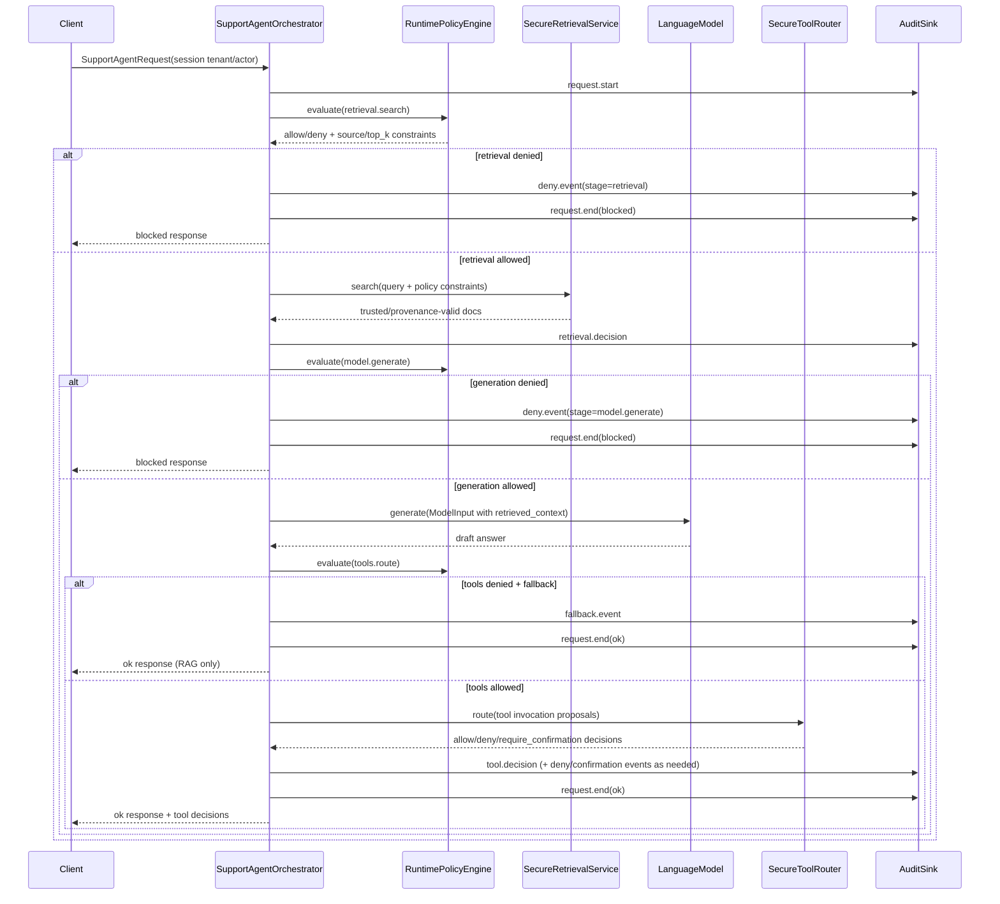
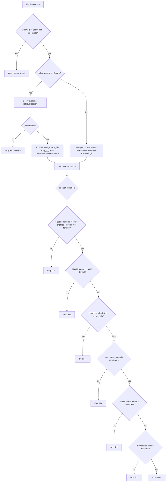
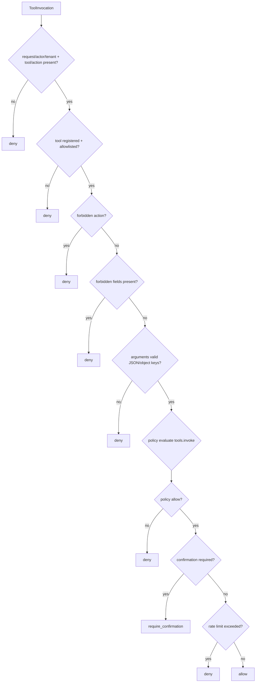
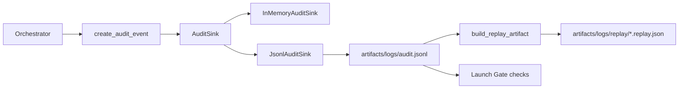

# Architecture Diagrams (Runtime-Aligned)

This document visualizes the **implemented** runtime architecture and trust boundaries in this repository.

For boundary-by-boundary control/risk/logging details, see `docs/trust_boundaries.md`.

For practical runtime deployment/control placement, see `docs/deployment_architecture.md`.

For concrete implemented threats, controls, and residual gaps, see `docs/threat_model.md`.

## 1) System Architecture Overview

```mermaid
flowchart LR
    U[User / Client] --> API[SupportAgentRequest + SessionContext]
    API --> ORCH[app/SupportAgentOrchestrator]

    ORCH -->|policy evaluate: retrieval.search\nmodel.generate\ntools.route| PE[policies/RuntimePolicyEngine]
    ORCH -->|retrieval query| SR[retrieval/SecureRetrievalService]
    SR --> RR[RawRetriever backend adapter]
    SR --> REG[SourceRegistry]

    ORCH -->|model input (RAG envelope)| LM[LanguageModel]

    ORCH -->|tool decision routing| TR[tools/SecureToolRouter]
    TR --> TREG[ToolRegistry]
    TR --> RL[ToolRateLimiter]
    TR -->|policy evaluate: tools.invoke| PE

    ORCH --> AUD[telemetry/audit sink]
    AUD --> JSONL[artifacts/logs/audit.jsonl]
    AUD --> REPLAY[replay artifact]

    EVAL[evals/SecurityEvalRunner] --> ORCH
    EVAL --> TR
    EVAL --> EOUT[artifacts/logs/evals/*.jsonl + *.summary.json]

    LG[launch_gate/SecurityLaunchGate] --> JSONL
    LG --> EOUT
    LG --> REPLAY
    LG --> POL[policies/bundles/default/policy.json]
```

## 2) Request / Data Flow Summary



## 3) Trust-Boundary Map

```mermaid
flowchart TB
    subgraph BoundaryA[Untrusted Boundary]
      Client[External user input]
    end

    subgraph BoundaryB[Application Trusted Runtime]
      Orchestrator[Orchestrator + Policy Engine]
      ToolRouter[SecureToolRouter]
      RetrievalSvc[SecureRetrievalService]
      Audit[Audit pipeline]
    end

    subgraph BoundaryC[Controlled Artifacts]
      PolicyFile[Policy bundle JSON]
      AuditJsonl[Audit JSONL]
      EvalArtifacts[Eval summaries]
      ReplayArtifacts[Replay JSON]
    end

    subgraph BoundaryD[Potentially Lower-Trust Content]
      RawRetriever[Raw retrieval backend]
      Sources[Registered sources\n(trust_domain constrained)]
      RetrievedChunks[Retrieved content chunks]
    end

    Client --> Orchestrator
    Orchestrator --> RetrievalSvc
    RetrievalSvc --> RawRetriever
    RawRetriever --> RetrievedChunks
    RetrievalSvc --> Sources
    Orchestrator --> ToolRouter
    Orchestrator --> Audit

    PolicyFile --> Orchestrator
    PolicyFile --> ToolRouter
    PolicyFile --> RetrievalSvc

    Audit --> AuditJsonl
    Audit --> ReplayArtifacts
```

## 4) Retrieval Boundary Summary (Enforcement View)



## 5) Tool-Routing Flow (Mediation View)



## 6) Policy Enforcement Points

- `retrieval.search` is evaluated before retrieval execution.
- `model.generate` is evaluated before model generation.
- `tools.route` is evaluated before tool decision routing in orchestrator.
- `tools.invoke` is evaluated inside tool router for each invocation.
- Kill-switch and invalid-policy states are fail-closed.

## 7) Telemetry / Audit Flow



## Notes for Reviewers

- Diagrams intentionally show only implemented components and decision points.
- Tool scenarios in evals may be `router_only` by design and explicitly labeled in scenario metadata.
- Launch-gate decisions are evidence-tied; `go` is not produced without artifact-backed checks.
